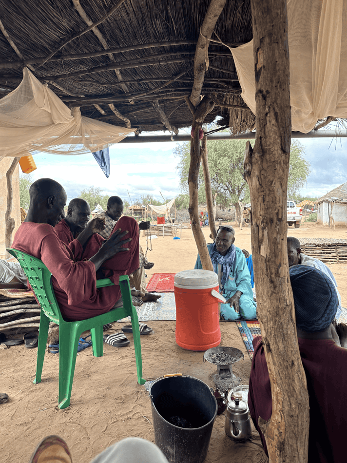
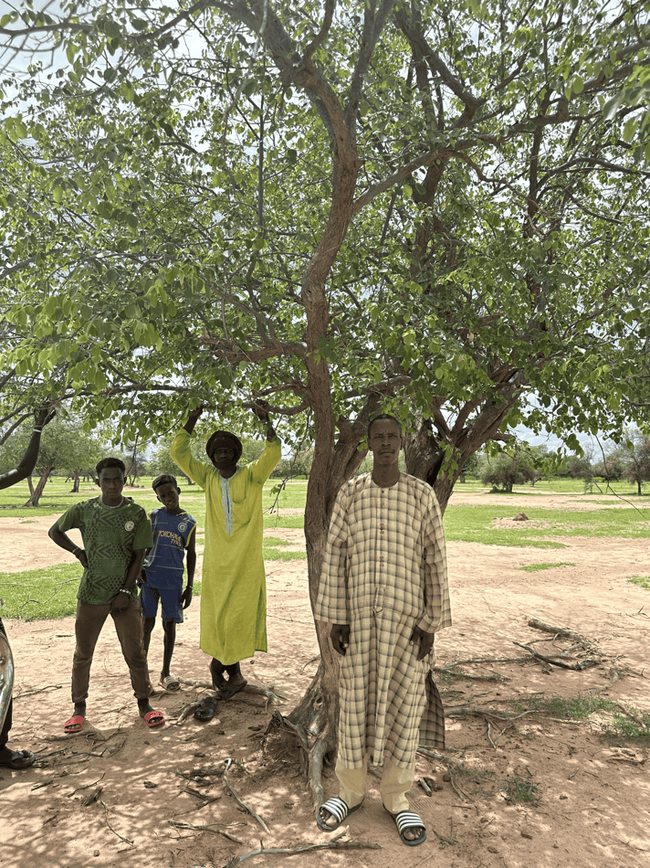
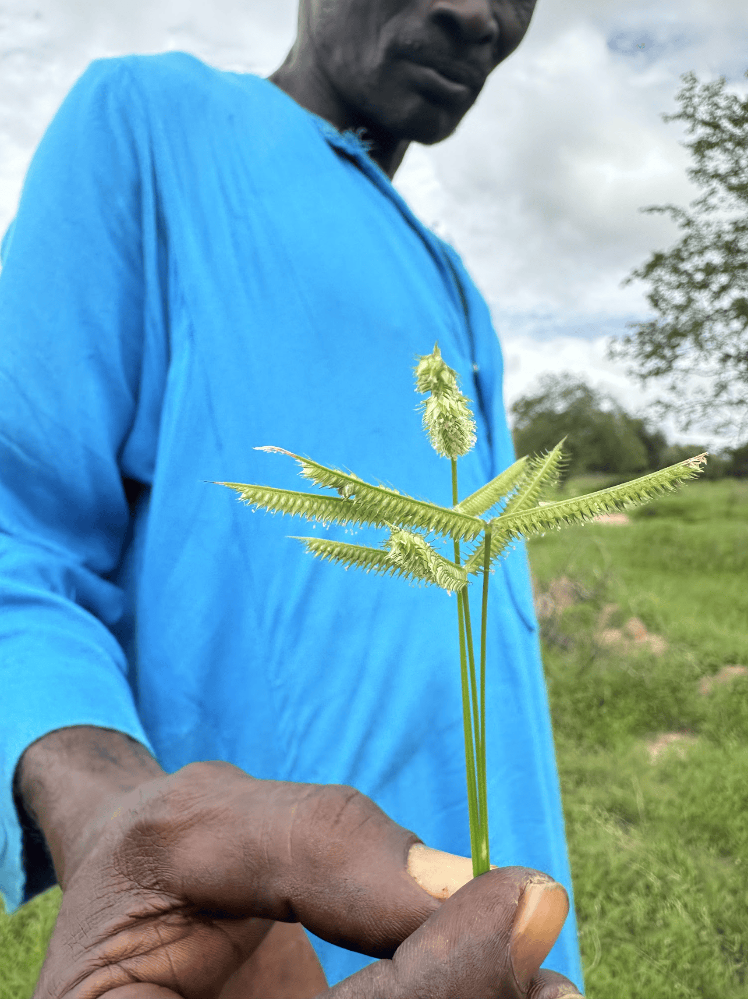
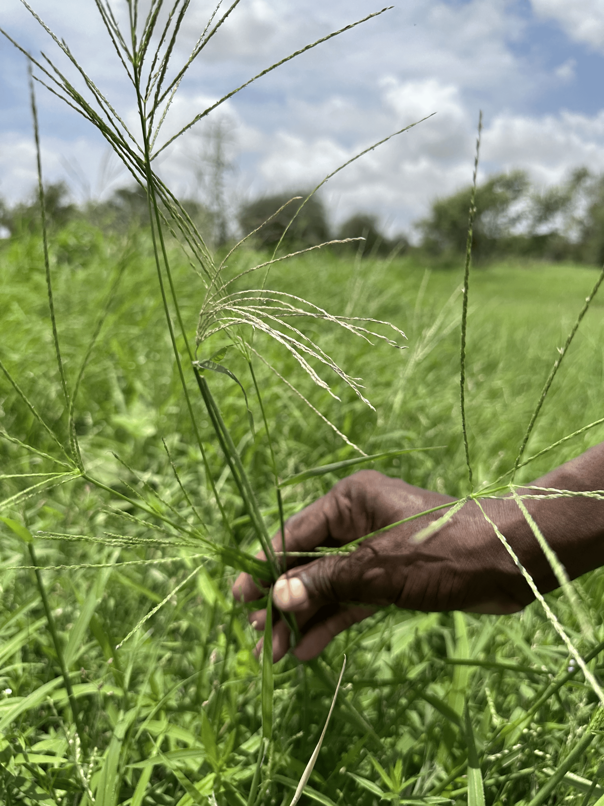
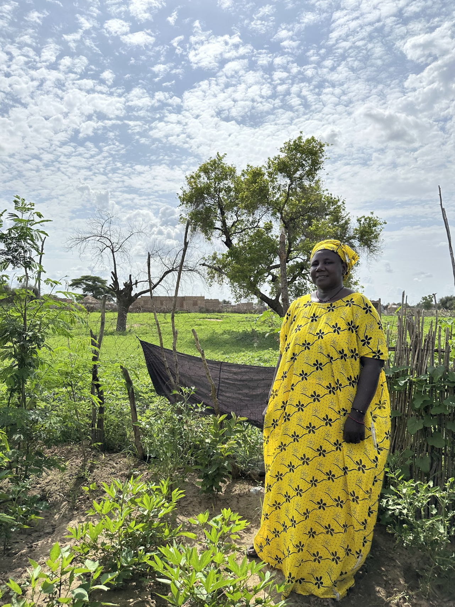

```{=html}

<div class="sub-hero" style="background-image: url('images/img1.png');">
  <div class="sub-hero-inner">
    <div class="sub-hero-eyebrow">K4GGWA • Senegal • Community engagement</div>
    <h1 class="sub-hero-title">Community Perspectives on Restoration</h1>
    <p class="sub-hero-subtitle">
      Local Knowledge and Grassland Recovery in Younofere & Tiafaly (Aug 2025)
    </p>
  </div>
</div>

<div class="sub-layout">
  <aside class="sub-meta">
    <div class="sub-meta-inner">
      <div class="sub-meta-label">Published</div>
      <div class="sub-meta-text">September 28, 2025</div>

      <div class="sub-meta-label" style="margin-top:1.25rem;">Tags</div>
      <div>
        <span class="meta-badge">Senegal</span>
        <span class="meta-badge">Rangelands</span>
        <span class="meta-badge">Community monitoring</span>
        <span class="meta-badge">Restoration</span>
      </div>

      <div class="sub-meta-label" style="margin-top:1.25rem;">At a glance</div>
      <div class="insight-mini">
        <div><strong>2</strong><span>Pastoral units</span></div>
        <div><strong>50–160 ha</strong><span>Exclosures</span></div>
        <div><strong>10+</strong><span>Native grass species</span></div>
        <div><strong>3</strong><span>Focus groups</span></div>
      </div>
    </div>
  </aside>

  <main class="sub-main">
    <div class="insight-lede">
      As part of the August 2025 capacity building activities, CIFOR-ICRAF and partners conducted community engagement sessions in the pastoral units of <strong>Younofere</strong> and <strong>Tiafaly</strong> in Senegal’s Louga region. Through focus groups and site visits, community members shared lived experiences of land degradation, restoration, and rangeland management.
    </div>

    <div class="insight-takeaways">
      <h3>Key takeaways</h3>
      <ul>
        <li>Sylvopastoral exclosures (“parcelles”) have enabled visible grassland and tree recovery.</li>
        <li>Community observations align with emerging biophysical indicators of rangeland improvement.</li>
        <li>Governance, trust, and collective action are central to sustaining restoration outcomes.</li>
      </ul>
    </div>
  
  <hr class="section-divider">

```

In August 2025, CIFOR-ICRAF and partners visited the pastoral units of Younofere and Tiafaly in Senegal’s Louga region. Through focus group discussions and site visits, **community members shared their experiences of land degradation, restoration, and rangeland management**.

These engagement sessions were designed to understand local and lived realities of climate trends, vegetation dynamics and other interstitial observations and experiences that give sense to high-level data observations. 

## Recovering landscapes through exclosures

At both sites, community members described how sylvopastoral exclosures (“parcelles”) have transformed previously degraded areas into productive rangelands. Parcelles typically range from 50 to 160 hectares and are subdivided into areas of reforestation, direct seeding, and natural regeneration.

Over time, native tree and grass species have re-established, improving fodder availability and soil condition. Tree species include baobab (bouye), desert date (soumpe), moringa (nebedaye), and gum arabic (tatuki), valued for food, fodder, and traditional uses. Women’s associations now process fruits and leaves into local products, strengthening links between restoration and household income.

<div style="display:flex; gap:1rem; margin:1.5rem 0;">   </div>
<p style="text-align:center;">
  <em>Community discussions in Younofere during field visits</em>
</p>

## Native grass regeneration

Villagers highlighted the return of native grass species such as *Mbambta, Gurdugal*, and *Dengko* - highly palatable and culturally important fodder species that had disappeared for more than a decade from heavily grazed areas.

The reappearance of these grasses is locally understood as a key signal of rangeland recovery, reflecting improved soil moisture, reduced grazing pressure, and better control over access and timing of grazing. In some parcelles, AVSF–ISRA research plots support grass biomass and quality measurements, helping to quantify changes that pastoralists observe through daily herd management.

<div style="display:flex; gap:1rem; margin:1.5rem 0;">   </div>
<p style="text-align:center;">
  <em>Local community members show native regeneration of grass species in exclosure zones</em>
</p>

## Managing persistent challenges

Despite visible recovery, communities identified a number of ongoing pressures affecting restored and open rangelands:

- Overgrazing linked to transhumant livestock movements
- Water scarcity and disputes over borehole management
- Termite damage to seedlings and stored feedstock
- Flooding linked to new roads and altered drainage
- Recurrent bushfires threatening restored plots

Participants consistently emphasised that restoration is not only ecological, but social. Managing parcelles, water points, and grazing routes requires trust, shared rules, and inclusive decision-making.

## Governance and collective action

Each pastoral unit is overseen by a ten-member committee representing different community groups. These committees:

- Manage water infrastructure
- Coordinate feedstock access
- Organise tree-protection patrols
- Mediate disputes over grazing and transhumance routes
- Convene assemblies for collective decision-making

Through these structures, restoration becomes a process of negotiated access and shared responsibility, anchoring ecological recovery in local institutions.

<div style="display:flex; gap:1rem; margin:1.5rem 0;">   </div>
<p style="text-align:center;">
  <em>Local governance and social dynamics are key to ecological restoration in rangeland systems </em>
</p>

## Linking community insight to land health monitoring

Community members stressed that restoration success depends as much on governance, trust, and participation as on tree planting or grass recovery. By pairing these perspectives with LDSF surveys and remote-sensing indicators, the project ensures that:

- Local priorities inform national restoration planning
- Spatial analyses are grounded in lived experience
- Monitoring systems support adaptive management

In this way, narratives from Younofere and Tiafaly shape how restoration across the Great Green Wall is designed, monitored, and governed - aligning scientific assessment with the knowledge of those most dependent on the land.

For further information, contact:
**a.hawkins@cifor-icraf.org**

<br><br>

```{=html}
<section class="toolkit-cred">
      <h2 class="toolkit-h3">Learn more</h2>
            <div class="toolkit-cards">
                <a class="toolkit-card" href="https://k4ggwa.thegrit.earth/content/restoration-stories/posts/28-10-2024/restoration-predictive.html">

                <div class="toolkit-card-thumb">
                    
                </div>

                <div class="toolkit-card-top">
                    <div class="toolkit-card-title">Predictive Modeling for Restoration</div>
                    <div class="toolkit-card-tag">Guide</div>
                </div>
                <p class="toolkit-card-desc">
                    Explore how predictive maps are generated, from raw data collection in the field, to analytics and outputs. 
                </p>
            
                </a>

                <a class="toolkit-card" href="https://k4ggwa.thegrit.earth/content/restoration-stories/posts/27-10-2024/regreening_app.html">

                <div class="toolkit-card-thumb">
                    
                </div>

                    
                <div class="toolkit-card-top">
                    <div class="toolkit-card-title">Regreening App</div>
                    <div class="toolkit-card-tag">Mobile Application</div>
                </div>
                <p class="toolkit-card-desc">
                    Learn more about the features of this citizen-science data-collection tool for restoration project monitoring. 
                </p>
                </a>

                <a class="toolkit-card" href="https://ldsf.thegrit.earth/">

                <div class="toolkit-card-thumb">
                    
                </div>

                <div class="toolkit-card-top">
                    <div class="toolkit-card-title">Land Degradation Surveillance Framework (LDSF)</div>
                    <div class="toolkit-card-tag">Data sampling</div>
                </div>
                <p class="toolkit-card-desc">
                    Learn more about the Land Degradation Surveillance Framework - the sampling protocol behind the world's largest systematic, georeferenced library of soil infrared spectra.
                </p>
                </a>
            </div>
    </section>
```

```{=html}
</main>
</div>
```