```{=html}
<div class="sub-hero" style="background-image: url('/assets/toolkit/intervention_map.jpg');">
  <div class="sub-hero-inner">
    <div class="sub-hero-eyebrow">K4GGWA • Senegal • Capacity building</div>
    <h1 class="sub-hero-title">Building Capacity for Restoration Monitoring</h1>
    <p class="sub-hero-subtitle">LDSF and Regreening App Training — Linguère, Senegal (Aug 2025)</p>
  </div>
</div>

<div class="sub-layout">
  <aside class="sub-meta">
    <div class="sub-meta-inner">
      <div class="sub-meta-label">Published</div>
      <div class="sub-meta-text">September 22, 2025</div>

      <div class="sub-meta-label" style="margin-top:1.25rem;">Tags</div>
      <div>
        <span class="meta-badge">Capacity building</span>
        <span class="meta-badge">Data collection</span>
        <span class="meta-badge">Citizen science</span>
        <span class="meta-badge">Land health</span>
      </div>

      <div class="sub-meta-label" style="margin-top:1.25rem;">At a glance</div>
      <div class="insight-mini">
        <div><strong>5</strong><span>Days</span></div>
        <div><strong>20</strong><span>Participants</span></div>
        <div><strong>7+</strong><span>Organisations</span></div>
        <div><strong>2</strong><span>Tools</span></div>
      </div>
    </div>
  </aside>

  <main class="sub-main">
    <div class="insight-lede">
      In August 2025, CIFOR-ICRAF convened a five-day theory-practical training in <strong>Linguère, Senegal</strong>, bringing together LDSF field methods and the <strong>Regreening App</strong> to strengthen evidence-based restoration monitoring across the Great Green Wall.
    </div>

    <div class="insight-takeaways">
      <h3>Key takeaways</h3>
      <ul>
        <li>The <strong>LDSF</strong> provides a repeatable, standardised baseline for biophysical land and soil condition.</li>
        <li>The <strong>Regreening App</strong> captures spatially explicit, community-level restoration actions through citizen science.</li>
        <li>Together, they link <strong>interventions</strong> to <strong>predictive land health maps</strong> for planning, monitoring, and reporting.</li>
      </ul>
    </div>

    <hr class="section-divider">
```

::: {.figure style="text-align:center;"}
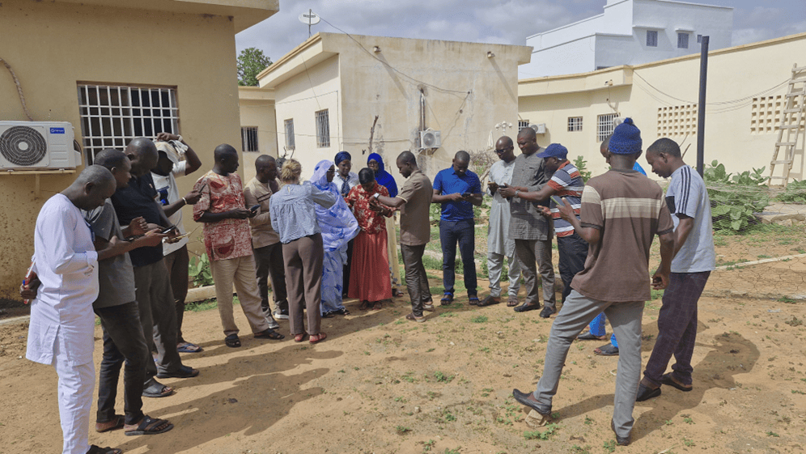{style="display:block; margin:2rem auto; width:100%; border-radius:18px;"}
*Regreening App practical demonstration of the new Rangeland module (2025).*
:::

At CIFOR-ICRAF, an integrated toolkit for land health monitoring has been developed to combine systematic data collection, predictive modelling, and participatory citizen science. This toolkit is grounded in two complementary approaches:

- **The Land Degradation Surveillance Framework (LDSF):** a standardised methodology for biophysical data collection that feeds into machine learning models to generate high-resolution predictive maps of soil and land health indicators. These maps are integrated into decision-support tools such as dashboards, posters, and reports that help stakeholders target interventions, monitor progress, and report against commitments.

- **The Regreening App:** a participatory citizen science tool that allows local actors to capture restoration data (including the location of restoration sites and metadata such as who, when, and what interventions took place). Overlaid on LDSF predictive maps, the Regreening App data provides a powerful complement to evidence based monitoring, enhancing decision-making and ensuring community contributions are captured in evidence systems.

In August 2025, these approaches were brought together in Linguère, Senegal, during a five-day combined theory-practical capacity building workshop under the Knowledge for Great Green Wall Action (K4GGWA) initiative. The training provided participants with both theoretical training and practical experience in LDSF survey work, and participatory monitoring through the Regreening App.

In total, **20 participants** took part in the training workshops including staff from:

- *Agence Sénégalaise de la Réforestation et de la Grande Muraille Verte (ASERGMV)*, Senegal  
- *Agence de la Grande Muraille Verte (APGMV)*, Mauritania  
- *Direction des Eaux et Forêts*, Senegal  
- *Agronomes et Vétérinaires Sans Frontières (AVSF)*, Senegal  
- *Entente des Groupements Associés pour le Développement à la Base (EGAB)*  
- *Association pour le Développement Intégré et Durable (ADID)*  
- *CIFOR-ICRAF* Mali 

Training activities therefore equipped key personnel from more than 7 different organisations with actionable knowledge on the tools and approaches available for restoration works. These activities were run in parallel to a series of community site visits, designed to integrate local perspectives into restoration evidence.

::: {.figure style="text-align:center;"}
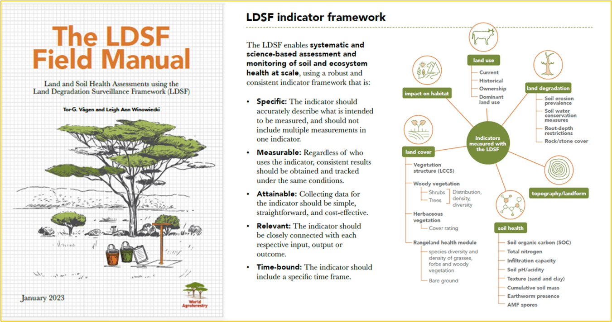{style="display:block; margin:2rem auto; width:100%; border-radius:18px;"}
*LDSF Theory Training — Linguère, August 2025*
:::

## LDSF training: from theory to field practice

The first component of the workshop focused on the Land Degradation Surveillance Framework (LDSF). Participants were trained on using the LDSF framework for collecting in-field data on land and soil health at the landscape level. Core elements included:
<br>

- **Soil sampling and characterisation** (texture, organic carbon, infiltration, erosion prevalence).
- **Vegetation assessments**, including tree and shrub density, species diversity, and herbaceous cover.
- **Landscape stratification** and the use of GPS and Open Data Kit (ODK) for digital data collection on land use, and other qualitative information.

Participants were trained on the theory aspect of the LDSF framework, before undertaking in-field practical training. Practical training included doing mock sampling work in sites close to the Linguère workshop venue, to get an applied understanding of how indicators are collected.

::: {.figure style="text-align:center;"}
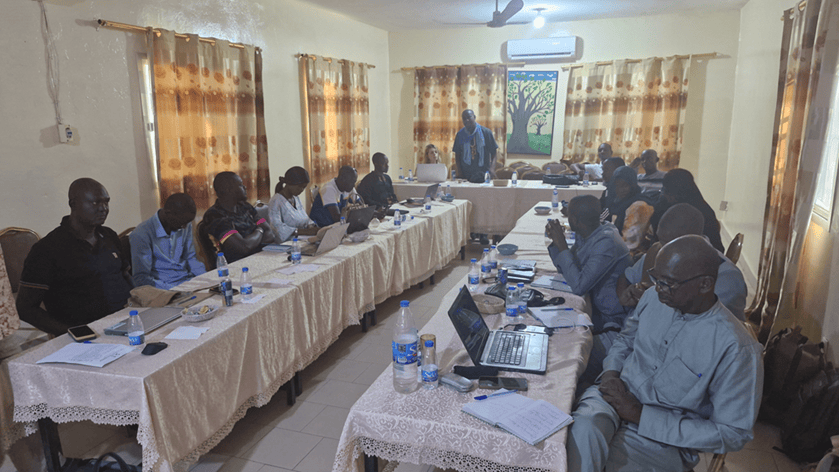{style="display:block; margin:2rem auto; width:100%; border-radius:18px;"}
*LDSF Theory Training - Linguere, August 2025*
:::

To complement the theoretical component to the LDSF training, physical land health maps of the Ferlo region were presented and circulated amongst participants to show how LDSF data is used to produce predictive maps. As a capacity building exercise, participants were prompted to interpret maps according to their local understanding of the terrain, and to think about how such maps could be used in different restoration decision-making contexts.

::: {.figure style="text-align:center;"}
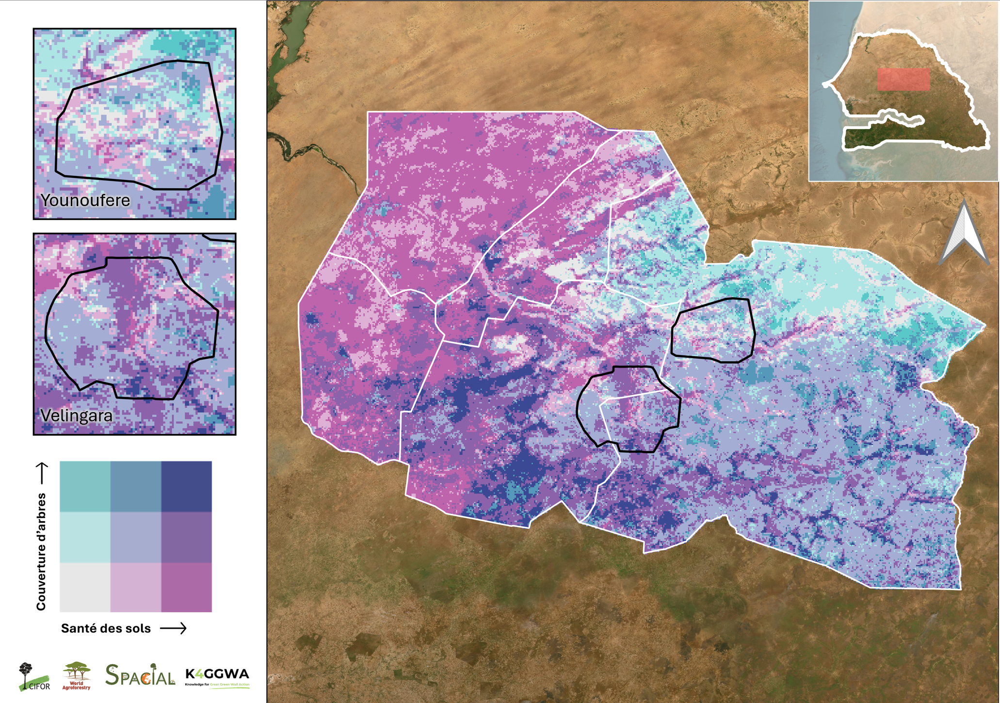{style="display:block; margin:2rem auto; width:100%; border-radius:18px;"}
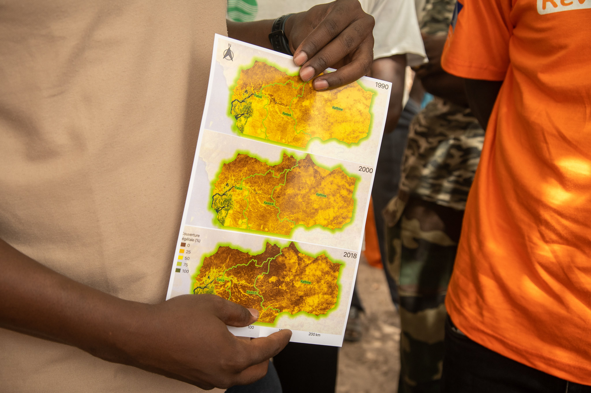{style="display:block; margin:2rem auto; width:100%; border-radius:18px;"}
*Capacity building exercise interrogating land health maps for the Ferlo Region, Senegal*
:::

```{=html}
<div class="story-divider"></div>
```

## Regreening App training: participatory monitoring

The second component of the workshop introduced the Regreening App, a mobile-based citizen science tool developed under the Regreening Africa programme. The training session emphasised how the app complements LDSF survey data by:
<br> 

- Capturing **community-level restoration data** such as tree planting, Farmer-Managed Natural Regeneration (FMNR), and soil and water conservation measures.  
- Recording **spatially explicit information** through GPS, enabling interventions to be mapped precisely.  
- Ensuring inclusivity with gender-disaggregated participation data and offline functionality for rural contexts.  

By linking citizen-generated data to predictive spatial maps derived from LDSF survey data, the Regreening App demonstrates the value of participatory monitoring systems. This integration strengthens transparency and accountability while ensuring community voices are a key part of restoration planning and reporting.


::: {.figure style="text-align:center;"}
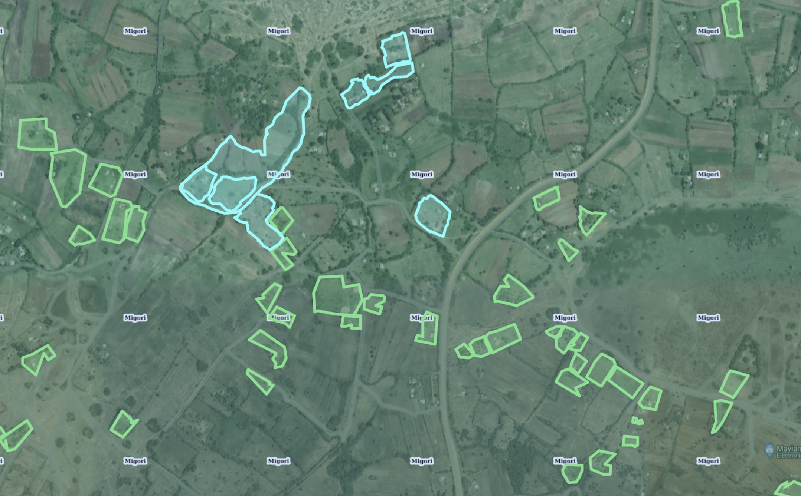{style="display:block; margin:2rem auto; width:100%; border-radius:18px;"}
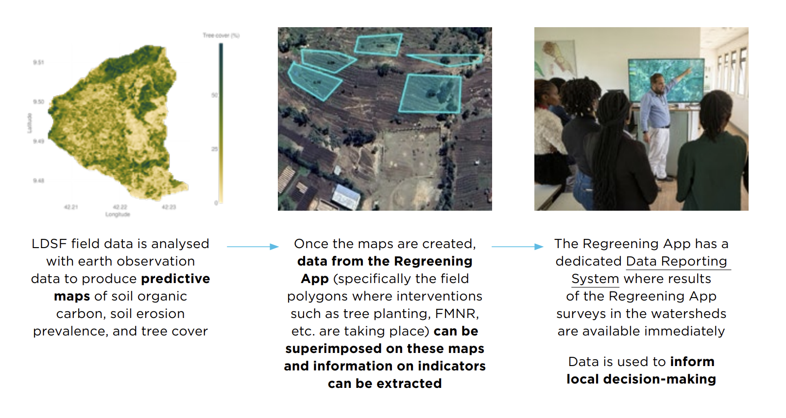{style="display:block; margin:2rem auto; width:100%; border-radius:18px;"}
*Linking the Regreening App with the LDSF Framework - how geolocational information logged in the app is overlaid on land health maps for monitoring*
:::

In particular, the training focused on an introduction and demonstration of the newly released Rangeland Module - a module designed to capture interventions specific to rangeland contexts. The Rangeland Module is designed to capture data specific to rangeland restoration and pastoral management. It is divided into two different subcomponents:

<br>
**1. Water points**
<br>
**2. Active restoration**

<div style="
  display: flex;
  justify-content: center;
  gap: 1.5rem;
  margin: 1.5rem 0;
">
  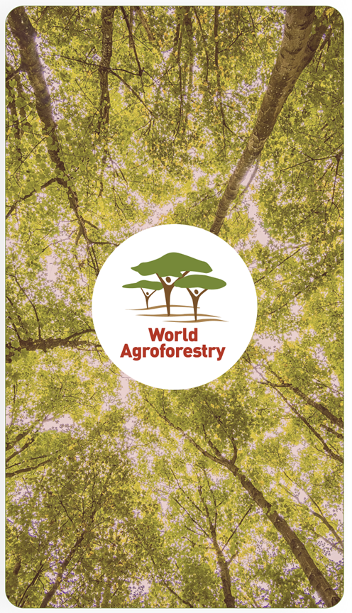
  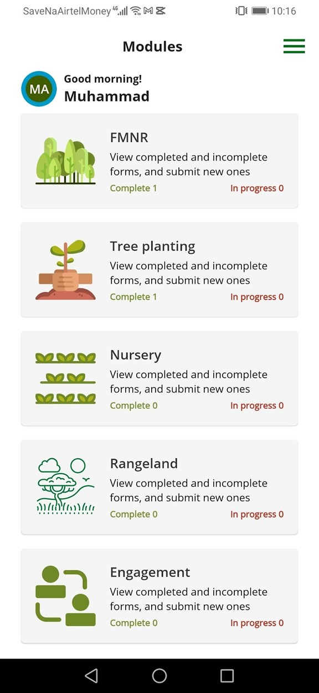
  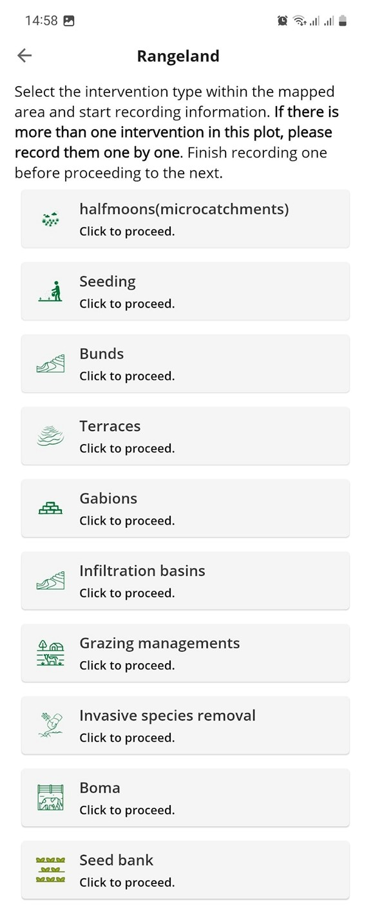
</div>

<p style="text-align:center;">
  <em>Screenshots of the Regreening App Rangeland Module</em>
</p>

Under each, there are a series of options for logging locational, quantitative and qualitative information on restoration techniques like building gabions, half-moons, mobile bomas and controlled grazing, as well as the location, type and quality of water points.

Stakeholders were trained on how to use the app for recording restoration practices as part of a project and, as with the other modules in the Regreening App (e.g., tree-planting, FMNR, nurseries etc), how to access their data via the Regreening App's Data Reporting System (DRS) platform, linking back to using intervention geometry data with land health maps, for monitoring.

::: {.figure style="text-align:center;"}
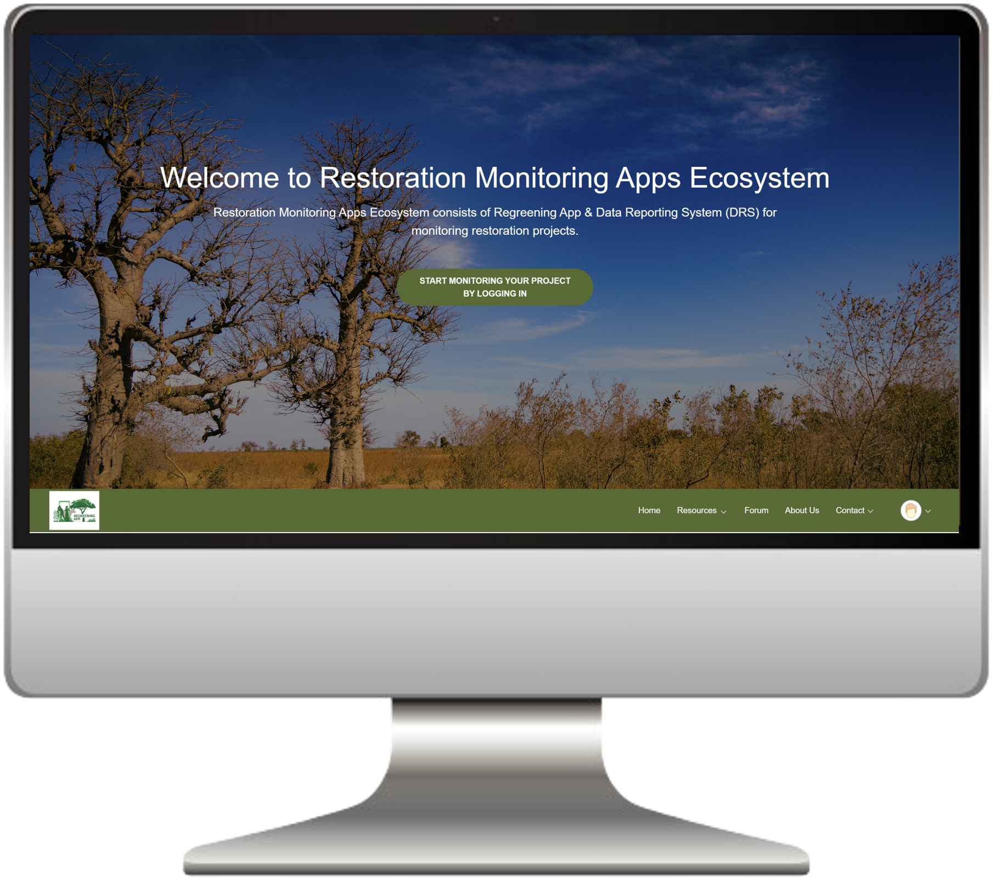{style="display:block; margin:2rem auto; width:100%; border-radius:18px;"}
*Regreening App Data Reporting System (DRS) - exporting project data for reporting and analysis.*
:::

## What next?

At the end of the five days, participants had received intensive training on CIFOR-ICRAF's state-of-the-art monitoring tools, equipped to apply them in their respective project contexts and geographies.

To learn more about the LDSF, [please visit the website here](https://ldsf.thegrit.earth/).

To learn more about how to implement the Regreening App in your own projects, [check out the website here](https://radrs.icraf.org/).

For further inquiries, contact us:

**gsl.icraf@gmail.com**
<br>
or
<br>
**m.ahmad@cifor-icraf.org**

<br><br>

```{=html}
<section class="toolkit-cred">
      <h2 class="toolkit-h3">Learn more</h2>
            <div class="toolkit-cards">
                <a class="toolkit-card" href="https://k4ggwa.thegrit.earth/content/restoration-stories/posts/28-10-2024/restoration-predictive.html">

                <div class="toolkit-card-thumb">
                    
                </div>

                <div class="toolkit-card-top">
                    <div class="toolkit-card-title">Predictive Modeling for Restoration</div>
                    <div class="toolkit-card-tag">Guide</div>
                </div>
                <p class="toolkit-card-desc">
                    Explore how predictive maps are generated, from raw data collection in the field, to analytics and outputs. 
                </p>
            
                </a>

                <a class="toolkit-card" href="https://k4ggwa.thegrit.earth/content/restoration-stories/posts/27-10-2024/regreening_app.html">

                <div class="toolkit-card-thumb">
                    
                </div>

                    
                <div class="toolkit-card-top">
                    <div class="toolkit-card-title">Regreening App</div>
                    <div class="toolkit-card-tag">Mobile Application</div>
                </div>
                <p class="toolkit-card-desc">
                    Learn more about the features of this citizen-science data-collection tool for restoration project monitoring. 
                </p>
                </a>

                <a class="toolkit-card" href="https://ldsf.thegrit.earth/">

                <div class="toolkit-card-thumb">
                    
                </div>

                <div class="toolkit-card-top">
                    <div class="toolkit-card-title">Land Degradation Surveillance Framework (LDSF)</div>
                    <div class="toolkit-card-tag">Data sampling</div>
                </div>
                <p class="toolkit-card-desc">
                    Learn more about the Land Degradation Surveillance Framework - the sampling protocol behind the world's largest systematic, georeferenced library of soil infrared spectra.
                </p>
                </a>
            </div>
    </section>
```

```{=html}
  </main>
</div>
```