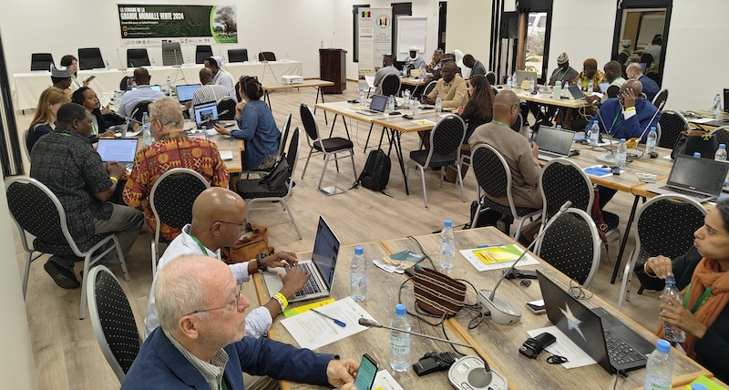

```{=html}
<div class="sub-hero" style="background-image: url('/assets/weekggw.jpg');">
  <div class="sub-hero-inner">
    <div class="sub-hero-eyebrow">K4GGWA • Senegal • Knowledge-exchange</div>
    <h1 class="sub-hero-title">Week on the Great Green Wall 2024</h1>
  </div>
</div>

<div class="sub-layout">
  <aside class="sub-meta">
    <div class="sub-meta-inner">
      <div class="sub-meta-label">Published</div>
      <div class="sub-meta-text">October 22, 2024</div>

      <div class="sub-meta-label" style="margin-top:1.25rem;">Tags</div>
      <div>
        <span class="meta-badge">Capacity building</span>
        <span class="meta-badge">Conference</span>
        <span class="meta-badge">Knowledge-management</span>
        <span class="meta-badge">Land health</span>
      </div>

      <div class="sub-meta-label" style="margin-top:1.25rem;">At a glance</div>
      <div class="insight-mini">
        <div><strong>5</strong><span>Days</span></div>
        <div><strong>>100</strong><span>Participants</span></div>
        <div><strong>7+</strong><span>Organisations</span></div>
        <div><strong>5</strong><span>Thematic areas</span></div>
      </div>
    </div>
  </aside>

  <main class="sub-main">
    <div class="insight-lede">
      The second edition of the “Week on the Great Green Wall” was held in Saly, Senegal, from September 9th to 12th, 2024. This multistakeholder forum brought together over 100 participants from across the Great Green Wall region to discuss progress, share knowledge, and plan for the future of land restoration. 
    </div>

    <div class="insight-takeaways">
      <h3>Key takeaways</h3>
      <ul>
        <li>Bringing together policymakers, practitioners, researchers, and community organisations to exchange experiences and lessons from across the Great Green Wall.</li>
        <li>Creating space for dialogue on what is working, where challenges remain, and how restoration efforts can be better coordinated across countries.</li>
        <li>Strengthening shared understanding of how evidence, local knowledge, and governance structures can support effective and inclusive restoration.</li>
      </ul>
    </div>

    <hr class="section-divider">
```

::: {.figure style="text-align:center;"}
{style="display:block; margin:2rem auto; width:100%; border-radius:18px;"}
*Regreening App practical demonstration of the new Rangeland module (2025).*
:::

From September 9th to 12th, 2024, in Saly, Senegal, the second edition of the event “a week on the Great Green Wall” was held. This workshop was placed under the patronage of the Ministry of Environment and Ecological Transition of Senegal, which is represented by Mr. Fodé Fall, the deputy minister. A total of 105 participants attended the workshop. These included experts from the Pan-African Agency and Member States, focal points from the GGW national agencies, regional organizations, United Nations agencies, Donors, Private sector, NGOs and Civil society.

::: {.figure style="text-align:center;"}
{style="display:block; margin:2rem auto; width:100%; border-radius:18px;"}
:::

```{r}
#| echo: false 

library(leaflet)

leaflet() |>
    addTiles() |>
    setView(lng = -16.5, lat = 14.5, zoom = 6)
```

<br>
Four days of activities were planned and cover several themes related to land restoration. The first day was focused on some achievements presented by the Pan-African Agency, CIFOR-ICRAF and FAO, the second day was focused on land health and tools used for monitoring and evaluation of the ecosystem services, while the third day focused on launch of the Great Green Wall Regional Support programs led by IFAD and the fourth day was focused on the private sector and investment as well as innovation in the Great Green Wall. The final day included a field trip.

```{=html}
<section class="toolkit-cred">
      <h2 class="toolkit-h3">Learn more</h2>
            <div class="toolkit-cards">
                <a class="toolkit-card" href="https://k4ggwa.thegrit.earth/content/restoration-stories/posts/28-10-2024/restoration-predictive.html">

                <div class="toolkit-card-thumb">
                    
                </div>

                <div class="toolkit-card-top">
                    <div class="toolkit-card-title">Predictive Modeling for Restoration</div>
                    <div class="toolkit-card-tag">Guide</div>
                </div>
                <p class="toolkit-card-desc">
                    Explore how predictive maps are generated, from raw data collection in the field, to analytics and outputs. 
                </p>
            
                </a>

                <a class="toolkit-card" href="https://k4ggwa.thegrit.earth/content/restoration-stories/posts/27-10-2024/regreening_app.html">

                <div class="toolkit-card-thumb">
                    
                </div>

                    
                <div class="toolkit-card-top">
                    <div class="toolkit-card-title">Regreening App</div>
                    <div class="toolkit-card-tag">Mobile Application</div>
                </div>
                <p class="toolkit-card-desc">
                    Learn more about the features of this citizen-science data-collection tool for restoration project monitoring. 
                </p>
                </a>

                <a class="toolkit-card" href="https://ldsf.thegrit.earth/">

                <div class="toolkit-card-thumb">
                    
                </div>

                <div class="toolkit-card-top">
                    <div class="toolkit-card-title">Land Degradation Surveillance Framework (LDSF)</div>
                    <div class="toolkit-card-tag">Data sampling</div>
                </div>
                <p class="toolkit-card-desc">
                    Learn more about the Land Degradation Surveillance Framework - the sampling protocol behind the world's largest systematic, georeferenced library of soil infrared spectra.
                </p>
                </a>
            </div>
    </section>
```

```{=html}
  </main>
</div>
```