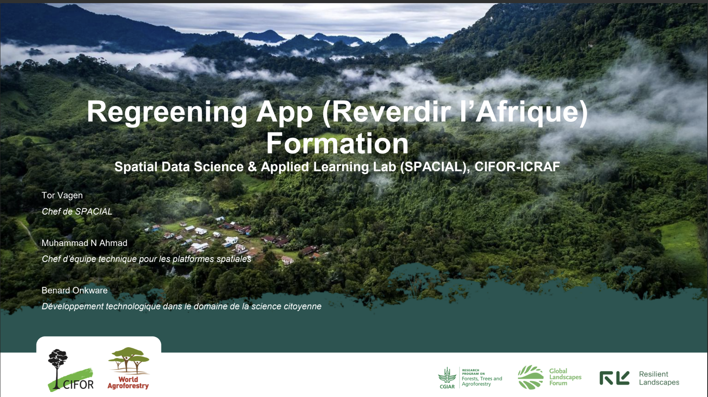
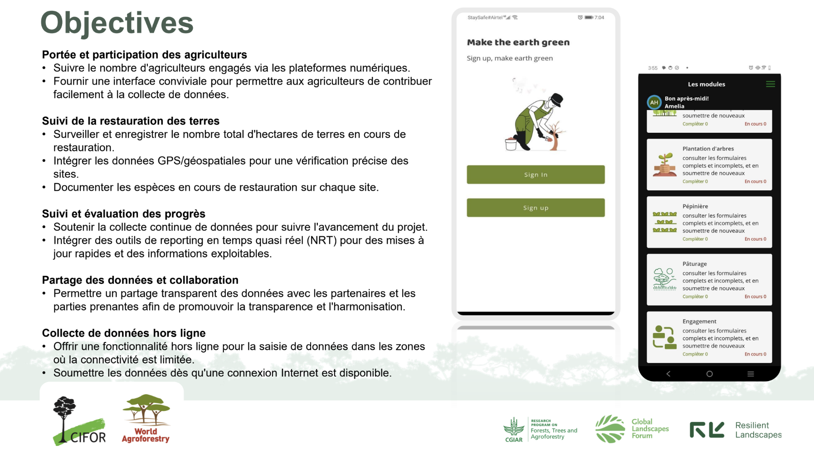
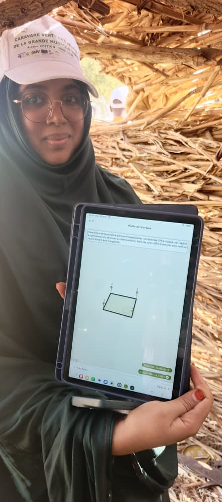
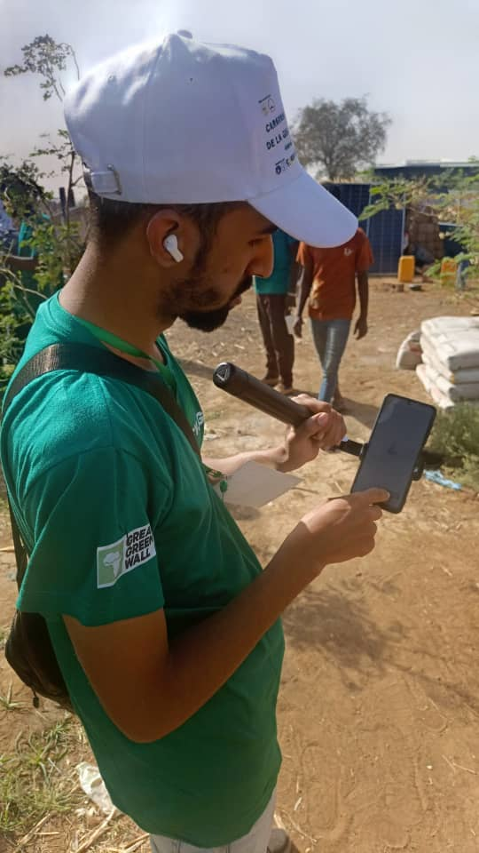
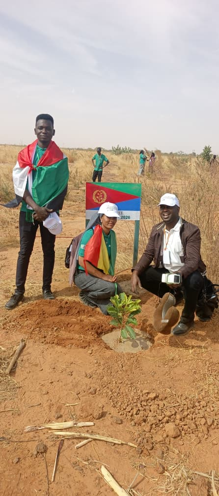
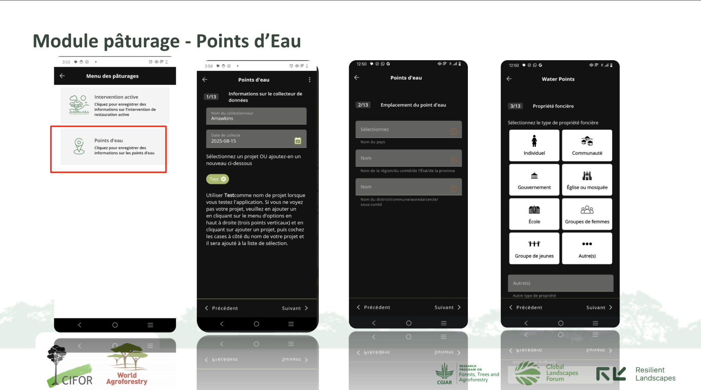
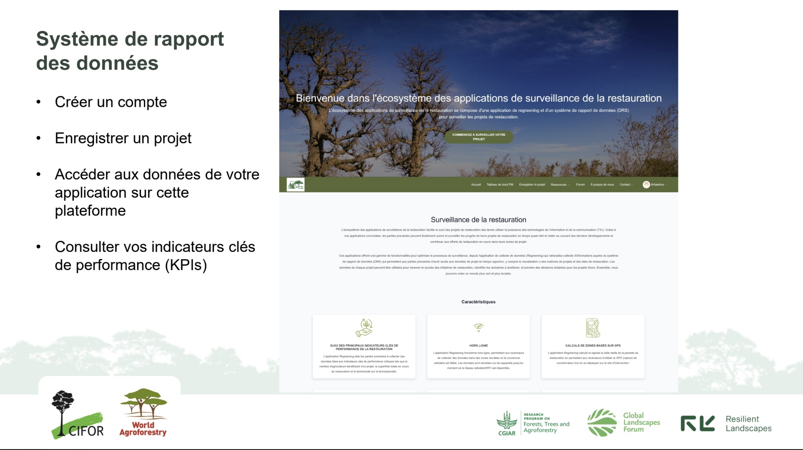

```{=html}
<div class="sub-hero" style="background-image: url('images/ra_yc3.jpeg');">
  <div class="sub-hero-inner">
    <div class="sub-hero-eyebrow">K4GGWA • Niger • Capacity building</div>
    <h1 class="sub-hero-title">Regreening App Training for GGW Youth Caravan</h1>
    <p class="sub-hero-subtitle">Equipping Sahelian youth with the skills to collect, manage and use high-quality restoration data in-situ</p>
  </div>
</div>

<div class="sub-layout">
  <aside class="sub-meta">
    <div class="sub-meta-inner">
      <div class="sub-meta-label">Published</div>
      <div class="sub-meta-text">September 22, 2025</div>

      <div class="sub-meta-label" style="margin-top:1.25rem;">Tags</div>
      <div>
        <span class="meta-badge">Capacity building</span>
        <span class="meta-badge">Data collection</span>
        <span class="meta-badge">Citizen science</span>
        <span class="meta-badge">Land health</span>
      </div>

      <div class="sub-meta-label" style="margin-top:1.25rem;">At a glance</div>
      <div class="insight-mini">
        <div><strong>~20</strong><span>Participants</span></div>
        <div><strong>5</strong><span>Countries</span></div>
      </div>
    </div>
  </aside>

  <main class="sub-main">
    <div class="insight-lede">
      In <strong>January 2026</strong>, participants of the <strong>Great Green Wall (GGW) Youth Caravan</strong> were onboarded to the <strong>Regreening App</strong> through an online training session led by the CIFOR-ICRAF SPACIAL team under the <strong>Knowledge for Great Green Wall Action (K4GGWA)</strong> programme. The session equipped youth with practical skills to collect <strong>geolocated restoration data</strong> in the field, and to use that data for learning, reporting, and storytelling along the Caravan route in Niger.
    </div>

    <div class="insight-takeaways">
      <h3>Key takeaways</h3>
      <ul>
        <li><strong>Citizen science</strong> turns youth and communities into trusted contributors to restoration evidence.</li>
        <li>The <strong>Regreening App</strong> enables participants to capture <strong>who did what, where, and when</strong>, including intervention type, species, and site context - using GPS-enabled smartphones.</li>
        <li>Data collected in the app is synced to the <strong>Data Reporting System (DRS)</strong>, where it becomes usable for <strong>monitoring, learning, reporting, and media narratives</strong>.</li>
      </ul>
    </div>

    <hr class="section-divider">
```

::: {.figure style="text-align:center;"}
{style="display:block; margin:2rem auto; width:100%; border-radius:18px;"}
{style="display:block; margin:2rem auto; width:100%; border-radius:18px;"}
*Regreening App Training Webinar - January 2026 GGW Youth Caravan.*
:::


## Purpose of the training: youth leadership, evidence, and storytelling

The GGW Youth Caravan is a youth-led, mobile engagement initiative that travels through Great Green Wall intervention zones to meet communities, visit restoration sites, and amplify local solutions. For the Niger Caravan edition (25 January – early February 2026), K4GGWA supported a dedicated “media + citizen science” track (the K-Prize) to strengthen youth capacity to:

- Document restoration innovations and livelihood impacts through photo, video, audio, and interviews
- Collect credible, geolocated evidence about restoration actions through citizen science
- Connect lived experience and local knowledge to decision-making spaces through youth-led narratives grounded in data
- This Regreening App training served as the induction moment—ensuring participants could confidently use a shared tool and shared concepts before deploying into the field.

<div style="
  display: flex;
  justify-content: center;
  gap: 1.5rem;
  margin: 1.5rem 0;
">
  
  
  
</div>

<p style="text-align:center;">
  <em>Photos from the field of participants capturing data using the Regreening App's Tree Planting module. Credit: Adama Tounkara</em>
</p>

## Training focus: citizen science and restoration M&E

The webinar introduced the Regreening App as a practical entry point to restoration monitoring and evaluation (M&E). Core themes included:

- **What is citizen science?** Why community-and youth-led data collection matters for restoration accountability.
- **What is restoration?** How monitoring links activities to outcomes over time.
- **What is the Regreening App?** An introduction to the app for documenting restoration interventions and impacts in-situ.
- **Why geolocation matters:** how GPS points and polygons make interventions mappable for understanding impacts over time and space.
- Introduction to the Restoration Monitoring Apps Ecosystem: how the App fits into an ecosystem of open-source tools for restoration monitoring. How to access data collected through the app and track KPIs.

In the session, participants were guided through the app’s core features and modules: creating an account, different modules available depending on unique restoration contexts, how to use each module and capture field observations. Participants were encouraged to then reuse evidence collected through the App for multiple needs - project reporting, learning, and storytelling.

::: {.figure style="text-align:center;"}
{style="display:block; margin:2rem auto; width:100%; border-radius:18px;"}
{style="display:block; margin:2rem auto; width:100%; border-radius:18px;"}
*Regreening App Training Webinar - January 2026 GGW Youth Caravan. Introduction to the Rangeland Module and the Data Reporting System (DRS) Platform.*
:::

## The Regreening App + DRS: from field observations to usable indicators

The Regreening App works together with the Data Reporting System (DRS). Data collected through the app can be uploaded and transformed into useful summaries and visuals supporting questions like:

- How many restoration sites were documented?
- How much land is under restoration (mapped as polygons)?
- Which interventions and species were recorded, and where?

Because the DRS also provides downloadable geospatial files (including polygons), youth-collected data can be combined with other evidence such as satellite imagery to explore change over time and strengthen learning and advocacy. 

## How the training connected to the GGW Youth Caravan K-Prize

The training was also designed to support the GGW Youth Caravan Media and Citizen Science K-Prize, which encourages teams to produce high-quality documentation of restoration journeys and impacts. Alongside the app onboarding, participants received guidance on:

- Preparing interviews and building a narrative arc aligned to the road-trip agenda
- Ethical and respectful documentation of communities and local leaders
- Basic photo/video/audio practices for clear and usable media outputs

This integrated approach helps ensure that youth outputs are both compelling and credible and that stories are grounded in lived experience, and supported by spatial data.

## What next?

Following the onboarding webinar, participants were encouraged to:

- Practice the app interface and key modules ahead of field deployment
- Join the ongoing support channels (e.g., WhatsApp/Telegram) for updates and troubleshooting
- Apply the Regreening App during the Caravan to document sites, interventions, and community restoration leadership in real time

To learn more about how to implement the Regreening App in your own projects, visit the DRS platform: [https://radrs.icraf.org/](https://radrs.icraf.org/)

For further inquiries, contact us:

**gsl.icraf@gmail.com**
<br>
or
<br>
**m.ahmad@cifor-icraf.org**

<br><br>

```{=html}
<section class="toolkit-cred">
      <h2 class="toolkit-h3">Learn more</h2>
            <div class="toolkit-cards">
                <a class="toolkit-card" href="https://www.youtube.com/@geosciencelab3450/videos">

                <div class="toolkit-card-thumb">
                    
                </div>

                <div class="toolkit-card-top">
                    <div class="toolkit-card-title">Training videos on the Regreening App and DRS</div>
                    <div class="toolkit-card-tag">Tutorials</div>
                </div>
                <p class="toolkit-card-desc">
                    Explore video tutorials on using the Regreening App, and accessing your data through the DRS platform. 
                </p>
            
                </a>

                <a class="toolkit-card" href="https://k4ggwa.thegrit.earth/content/restoration-stories/posts/27-10-2024/regreening_app.html">

                <div class="toolkit-card-thumb">
                    
                </div>

                    
                <div class="toolkit-card-top">
                    <div class="toolkit-card-title">Regreening App</div>
                    <div class="toolkit-card-tag">Mobile Application</div>
                </div>
                <p class="toolkit-card-desc">
                    Learn more about the features of this citizen-science data-collection tool for restoration project monitoring. 
                </p>
                </a>

                <a class="toolkit-card" href="https://ldsf.thegrit.earth/">

                <div class="toolkit-card-thumb">
                    
                </div>

                <div class="toolkit-card-top">
                    <div class="toolkit-card-title">Land Degradation Surveillance Framework (LDSF)</div>
                    <div class="toolkit-card-tag">Data sampling</div>
                </div>
                <p class="toolkit-card-desc">
                    Learn more about the Land Degradation Surveillance Framework - the sampling protocol behind the world's largest systematic, georeferenced library of soil infrared spectra.
                </p>
                </a>
            </div>
    </section>
```

```{=html}
  </main>
</div>
```